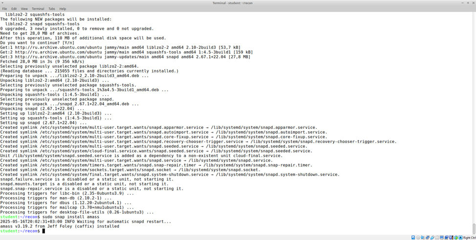
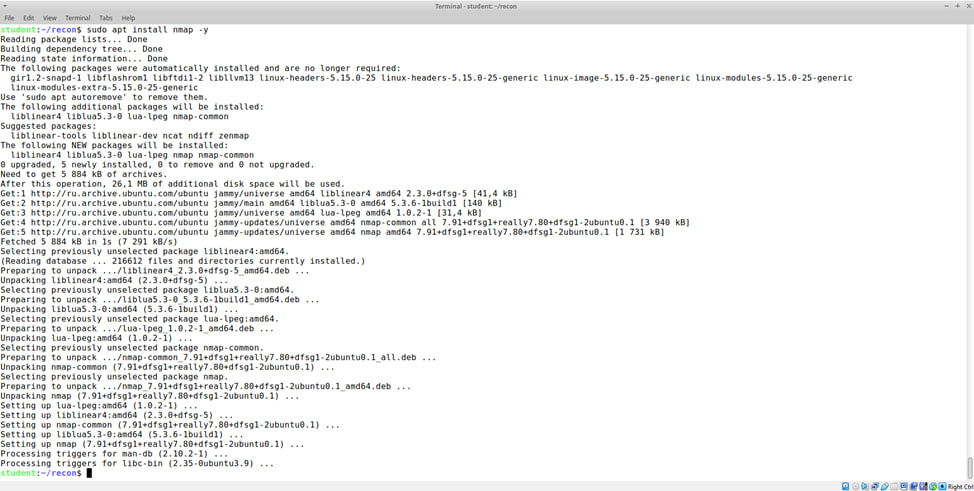

# Отчет о выполнении вариативного задания: разведка внешней корпоративной сети

## Введение
Исследование демонстрационного сайта `testphp.vulnweb.com` с использованием инструментов OSINT и активной разведки.

---

## Методология
### Инструменты:
- #### 1. Amass - сбор информации о поддоменах
{width=600px}  
*Рисунок 1: Установка Amass*

- #### 2. Nmap - сканирование портов
{width=600px}  
*Рисунок 2: Установка Nmap*

- #### 3. Shodan - анализ сервисов и уязвимостей
{width=600px}  
*Рисунок 3: Регистрация на Shodan*

- #### 4. LeakIX - поиск утечек данных
{width=600px}  
*Рисунок 4: Регистрация на LeakIX*

- #### 5. WHOIS - информация о домене
{width=600px}  
*Рисунок 5: Установка whois-утилиты*

- #### 6. Hunter.io - анализ технологического стека
{width=600px}  
*Рисунок 6: Регистрация на Hunter.io *

### Фреймворки:
- MITRE ATT&CK
- Cyber Kill Chain

---

## Результаты

### 1. Amass (пассивная разведка)
amass enum -passive -d testphp.vulnweb.com -o amass_passive.txt

**Найдено:** 2 поддомена

### 2. Nmap (активное сканирование)
nmap -sS -Pn -p1-1000 testphp.vulnweb.com -oN nmap_full.txt
Результат:

**Открыт порт:** 80/tcp (nginx)

**Закрыто:** 19 портов

### 3. Shodan

**IP:** 44.228.249.3

**Веб-сервер:** nginx/1.19.0

Уязвимости:

**CVE-2021-23017 (7.7) - DNS resolver crash**

**CVE-2023-44487 (7.5) - HTTP/2 DoS**

**CVE-2021-3618 (7.4) - ALPACA attack**

### 4. WHOIS

**Домен:** vulnweb.com

**Регистратор:** EuroDNS S.A.

**Создан:** 2010

**Истекает:** 2025

### 5. LeakIX

Редирект на testphp.vulnweb.com

SSL совпадение с cam-cad.ru

### 6. Hunter.io

**Технологии:** nginx, PHP, Ubuntu

**Организация:** Acunetix WVS

---

## Анализ через фреймворки
### MITRE ATT&CK

| Техника | Описание                  | Пример уязвимости       |
|---------|---------------------------|-------------------------|
| T1203   | Client Execution         | CVE-2021-23017         |
| T1499   | Endpoint DoS             | CVE-2023-44487         |
| T1557   | Man-in-the-Middle        | CVE-2021-3618          |

### Cyber Kill Chain

| Этап               | Применение                |
|--------------------|---------------------------|
| Recon              | WHOIS, Amass             |
| Delivery           | CVE-2023-44487           |
| Exploitation       | CVE-2021-23017           |
| Command & Control  | CVE-2021-3618            |

---

## Выводы

**Освоены:**

1. Методы OSINT и разведки
2. Работа с API инструментов
3. Анализ через MITRE ATT&CK
4. Оформление отчетов

**Обнаруженные уязвимости требуют внимания:**

1. Обновление nginx
2. Мониторинг SSL/TLS
3. Защита от DoS-атак

## Источники

- Shodan, LeakIX, Hunter.io

- Nmap, Amass

- MITRE ATT&CK
